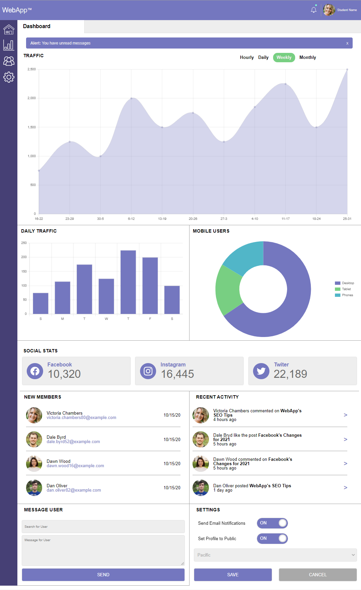

# Treehouse Front-End Web Development Project 7   WebApp Dashboard

by: Ahmed Roble [Github](https://github.com/airoble-1)

---

## Overview

In this project, you'll take a mockup and a few icons and build a beautiful, web dashboard complete with JavaScript-driven charts and graphs. You only need to take the design and create the HTML, CSS and JavaScript functionality for this one page -- you don't need to create other pages, or build any backend or database functionality.
 
 
 

